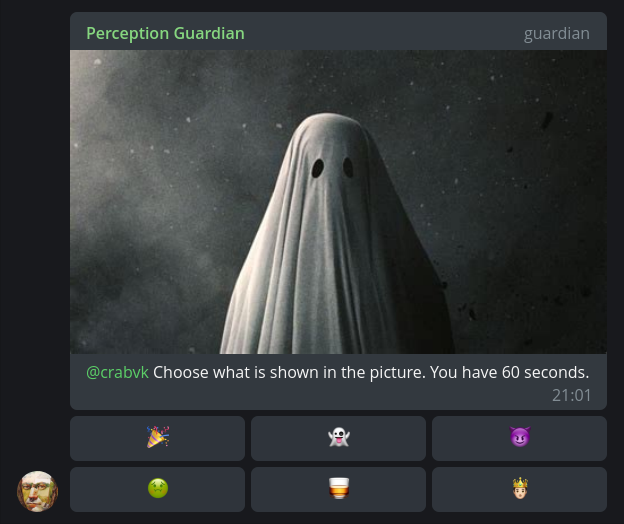

# DISCONTINUED: Further bot development is carried out [here](https://github.com/crabvk/perception-guardian) in Rust.

# Perception Guardian

Telegram bot with image-emoji CAPTCHA challenge-response.

## Features

* Show CAPTCHA for new members
* Ban channels [(optional)](#bot-settings)
* Change bot language for a group (only English and Russian supported at the time)
* Set custom Welcome message

## Configuration

Copy [config.example.yaml](config.example.yaml) to *config.yaml*. See comments for config settings descriptions.  
No defaults, all config settings are mandatory.

## Bot settings

Use `/settings` command to change bot settings for a group.

## TODO

* validate "Welcome message" markup
* limit number of New Chat Members per minute, don't show captcha when limit has reached
* /vacuum command to search and delete "Deleted Account"s
* detect spam
* periodicly delete expired "ignore" set key/scores
* https://stackoverflow.com/questions/61419046/administrator-permissions-check-aiogram
* /stats command to show bot statistics: number of users passed/not passed captcha for group, etc.
* add more emoji

## Resources

* [Emoji Meanings Encyclopedia](https://emojis.wiki/)
* [Different kinds of UTF symbols representing letters](https://util.unicode.org/UnicodeJsps/list-unicodeset.jsp?a=[%3AIdn_Mapping%3Da%3A])
